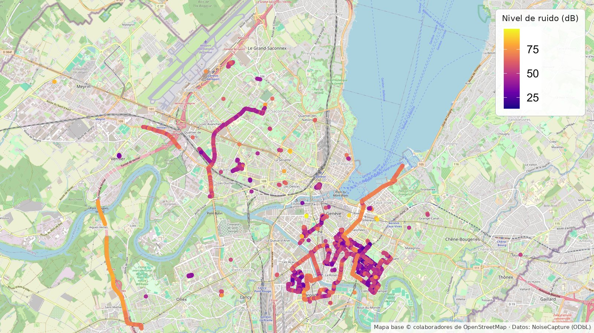
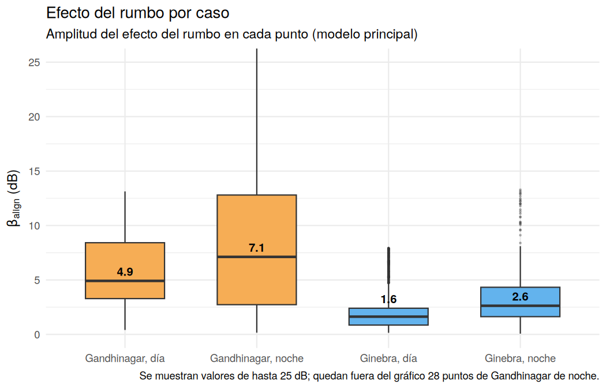
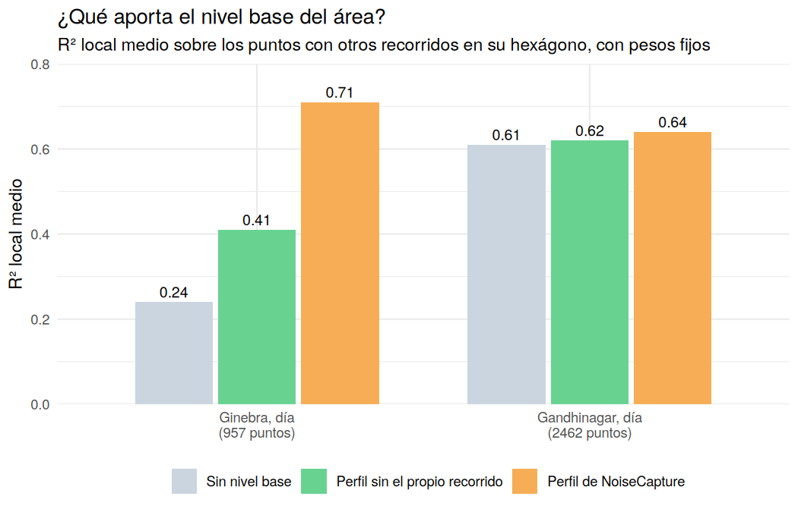
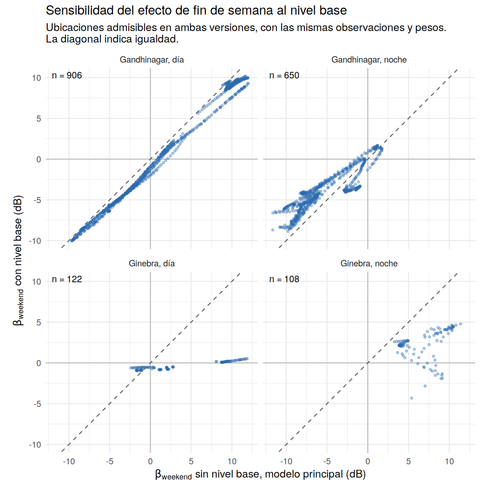
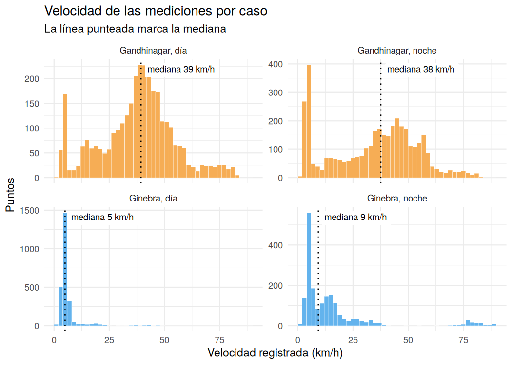

# Estructura espacial del ruido urbano

[English](README.md) | **Español**

¿Se pueden inferir las dinámicas del tránsito urbano a partir de la estructura
espacial de los niveles de ruido? Este proyecto analiza mediciones de ruido
recolectadas de forma colaborativa en Ginebra (Suiza) y Gandhinagar (India),
comparando día y noche, y días de semana y fines de semana.



*Mediciones de NoiseCapture en Ginebra, coloreadas por nivel de ruido.*

## En resumen

- **En los mapas, el rumbo pesa mucho más en Gandhinagar que en Ginebra, pero
  sobre todo por diferencias entre recorridos.** El GWR asocia diferencias
  típicas de 10 a 14 dB según el rumbo en Gandhinagar. Un modelo jerárquico,
  que separa el nivel propio de cada recorrido, reduce el efecto a 2 a 3 dB
  dentro de un mismo recorrido; en Ginebra no se distingue.
- **La velocidad sí tiene un efecto dentro de cada recorrido:** entre 0.45 y
  1.7 dB por m/s, según el caso.
- **El fin de semana solo puede compararse entre recorridos distintos.** Al
  tenerlo en cuenta, la disminución nocturna de Gandhinagar (−3.5 ± 2.5 dB) no
  se distingue de cero, mientras que los fines de semana más ruidosos de
  Ginebra (+9 a +13 dB) se sostienen.
- **El perfil horario de NoiseCapture resultó poco confiable como control en
  Ginebra.** La mayoría de los puntos no comparte su hexágono con otros
  recorridos, y el ajuste dependía mucho de cómo se construía ese perfil. Por
  eso el modelo principal no lo incluye.
- **Las ciudades se midieron de forma distinta,** mayormente en vehículo en
  Gandhinagar y mayormente a pie en Ginebra de día. Por eso la comparación se
  limita a la estructura espacial y temporal, y los resultados describen
  asociaciones, no efectos causales.
- **Esas asociaciones describen la muestra, pero anticipan poco el nivel de
  recorridos nuevos.** Al predecir recorridos que no participaron del ajuste,
  el error absoluto medio fue de 8.6 a 12.2 dB, cerca del que se obtiene con la
  media (9.7 a 12.0 dB). Entre el 62% y el 77% de la variación del nivel está
  entre recorridos.

## Mapas interactivos

- [Gandhinagar: día](https://ca90m.github.io/urban-noise-spatial-analysis/gandhinagar_dia.html)
- [Gandhinagar: noche](https://ca90m.github.io/urban-noise-spatial-analysis/gandhinagar_noche.html)
- [Ginebra: día](https://ca90m.github.io/urban-noise-spatial-analysis/ginebra_dia.html)
- [Ginebra: noche](https://ca90m.github.io/urban-noise-spatial-analysis/ginebra_noche.html)

Los mapas corresponden a los modelos principales, que no incluyen el nivel
base del área. La versión con ese predictor se utilizó como análisis de
sensibilidad, y sus resultados se resumen más adelante. Los coeficientes de los
mapas mezclan diferencias dentro de cada recorrido y entre recorridos; la
sección *Efectos dentro de los recorridos* muestra cuánto queda de cada efecto
al separarlas.

Los mapas se construyeron con leaflet en R. Se abren en cualquier navegador,
sin necesidad de instalar nada. Los controles de capas y las ventanas
emergentes permiten alternar entre español e inglés.

## Datos

Mediciones móviles de ruido con nivel sonoro, velocidad, rumbo, precisión del
GPS y ganancia de calibración del dispositivo, provenientes del conjunto de
datos colaborativo NoiseCapture ([Noise-Planet](https://noise-planet.org/),
UMRAE y Lab-STICC, distribuido bajo
[ODbL](https://opendatacommons.org/licenses/odbl/)). Las mediciones se obtienen
mediante una aplicación de Android, lo que explica la amplia dispersión en la
ganancia de calibración de los dispositivos. Los datos tienen una estructura
jerárquica: las muestras pertenecen a recorridos, y los recorridos a áreas
urbanas. Los registros se filtraron con criterios de calidad espaciotemporal y
umbrales de precisión, y las marcas de tiempo se convirtieron a la hora local.

## Metodología

**Dependencia espacial.** El índice I de Moran y los indicadores LISA mostraron
autocorrelación espacial global y agrupamientos locales en los niveles de
ruido. Se utilizó GWR para explorar cómo variaban las asociaciones con la
velocidad y la dirección del movimiento dentro de las áreas de estudio.

**Regresión local.** Se aplicó regresión geográficamente ponderada (GWR) con
dos representaciones del rumbo: direccional (0–360°), que distingue sentidos
opuestos, y axial (0° ≡ 180°), que los considera equivalentes. La comparación
buscó evaluar si el nivel de ruido se asociaba principalmente con el eje del
desplazamiento o si distinguir su sentido aportaba información.

La geometría de las calles y las reflexiones del sonido entre fachadas
motivaron considerar patrones asociados con el eje de circulación. A su vez,
las diferencias de exposición a las fuentes y la emisión desigual de sonido
según la dirección podrían generar diferencias entre sentidos. También se
consideró el posible papel del efecto Doppler, ligado al movimiento relativo
entre fuente y receptor y al cambio en la frecuencia recibida.

El rumbo registrado corresponde al desplazamiento de quien mide y no
identifica directamente la dirección de llegada del sonido. Por eso, la
comparación permite evaluar qué representación del rumbo resulta más útil,
aunque las diferencias de ajuste no permiten identificar por sí solas los
mecanismos físicos que originan los patrones observados.

**Especificación del modelo.** Para cada medición $i$, tomada en la ubicación
$u_i$, el nivel de ruido $L_i$ (dB) se modela como:

```math
\begin{aligned}
L_i ={}& \beta_0(u_i) + \beta_{\text{speed}}(u_i)\,v_i
       + \beta_{\cos}(u_i)\,\tilde c_i + \beta_{\sin}(u_i)\,\tilde s_i
       + v_i\big[\gamma_{\cos}(u_i)\,\tilde c_i + \gamma_{\sin}(u_i)\,\tilde s_i\big] \\
      &+ \beta_{\text{hs}}(u_i)\,h^s_i + \beta_{\text{hc}}(u_i)\,h^c_i
       + \beta_{\text{count}}(u_i)\,m_i
       + \beta_{\text{weekend}}(u_i)\,w_i + \varepsilon_i
\end{aligned}
```

Todos los coeficientes dependen de la ubicación: GWR los estima en cada punto,
con más peso para las observaciones cercanas. $v_i$ es la velocidad
estandarizada. $\tilde c_i$ y $\tilde s_i$ son el coseno y el seno del rumbo
$\theta_i$, centrados en su media. En el modelo direccional se usan
$\cos\theta_i$ y $\sin\theta_i$; en el axial, $\cos 2\theta_i$ y
$\sin 2\theta_i$, que valen lo mismo para $\theta$ y $\theta + 180^\circ$. Por
eso el modelo axial no distingue sentidos opuestos. El término entre corchetes
permite que el efecto del rumbo cambie con la velocidad.

Los demás términos son controles. $h^c_i$ y $h^s_i$ representan la hora como
coseno y seno de $2\pi \cdot \text{hora}_i / 24$, de modo que las 23 h y las
0 h quedan cerca. El seno entra residualizado: se reemplaza por el residuo de
su regresión lineal sobre el coseno (es decir, se ortogonaliza). Es solo una
reparametrización: el ajuste y los residuos no cambian. $m_i$ es el logaritmo
de uno más la cantidad de mediciones del área de NoiseCapture en la que cae el
punto, estandarizado. $w_i$ es el indicador de fin de semana, centrado.

Cada coeficiente se lee así:

| Coeficiente | Qué mide |
|---|---|
| $\beta_0$ | Nivel base del lugar: el nivel esperado a velocidad media, con las demás variables en su valor de referencia. En los mapas se muestra trasladado a velocidad nula. |
| $\beta_{\text{speed}}$ | Cuántos dB cambia el nivel por cada desvío estándar de velocidad, promediando sobre los rumbos. En los mapas se expresa en dB por m/s. |
| $\beta_{\cos}$, $\beta_{\sin}$ | Efecto del rumbo a velocidad media. En el modelo direccional, $\beta_{\cos}$ compara el desplazamiento hacia el norte con el desplazamiento hacia el sur, y $\beta_{\sin}$, hacia el este con hacia el oeste. En el axial, $\beta_{\cos}$ compara el eje norte-sur con el eje este-oeste, y $\beta_{\sin}$, el eje noreste-suroeste con el eje noroeste-sureste. En todos los casos, la diferencia entre ambos es el doble del coeficiente, y un valor positivo indica más ruido en el primero. Por separado dependen de cómo se orientan los ejes; por eso se resumen en $\beta_{\text{align}}$. |
| $\gamma_{\cos}$, $\gamma_{\sin}$ | Cuánto cambia el efecto del rumbo por cada desvío estándar de velocidad. Visto al revés, indican si el efecto de la velocidad depende del rumbo. |
| $\beta_{\text{hc}}$, $\beta_{\text{hs}}$ | Describen conjuntamente la variación horaria del nivel dentro de cada franja (día, de 7 a 19 h; noche, de 19 a 7 h) mediante términos coseno y seno. |
| $\beta_{\text{count}}$ | dB por cada desvío estándar del logaritmo de la cantidad de mediciones del área. Funciona sobre todo como control de la intensidad de muestreo, sin una lectura física directa. |
| $\beta_{\text{weekend}}$ | Diferencia local de nivel entre fines de semana y días hábiles, en dB, ajustada por velocidad, rumbo, hora y cantidad de mediciones. |
| $\beta_{\text{align}}$ | Amplitud del efecto del rumbo, en dB. Se detalla más abajo. |

Ambas variantes tienen los mismos términos y difieren solo en cómo codifican el
rumbo. El ancho de banda es adaptativo y se eligió por AICc, junto con el
kernel (gaussiano o bicuadrado). Entre las dos variantes se eligió la de mayor
R² local medio; ante un empate, la de menor AICc.

**Nivel base del área: evaluado y excluido del modelo principal.** NoiseCapture
publica, para cada hexágono de 15 m de radio, un perfil horario del nivel
sonoro (la mediana, LA50, de cada hora en días hábiles, sábados y domingos).
Ese perfil podría servir como control del contexto del lugar, pero se calcula
con las mismas mediciones colaborativas que se modelan. Para evaluar cuánto
dependía el ajuste de las mediciones del propio recorrido, se calculó un
perfil alternativo a partir de los puntos crudos: para cada punto, la mediana
de su hexágono, hora y tipo de día, excluyendo todas las mediciones de su mismo
recorrido. Cuando no había mediciones de otros recorridos en esa combinación de
hora y tipo de día, se utilizó la mediana general del hexágono, también
excluyendo el recorrido evaluado. Se compararon tres versiones del modelo
sobre las mismas observaciones y con los mismos pesos: sin nivel base, con el
perfil sin el propio recorrido y con el perfil de NoiseCapture. Los resultados
(ver Resultados) llevaron a excluirlo del modelo principal. La versión con el
perfil de NoiseCapture se conserva como análisis de sensibilidad, con las
mismas observaciones, la misma codificación del rumbo y los mismos pesos
espaciales que el modelo principal.

**Coeficiente de alineación.** El efecto del rumbo se resume en un solo valor
por ubicación:

```math
\beta_{\text{align}}(u) = \sqrt{\beta_{\cos}(u)^2 + \beta_{\sin}(u)^2}
```

A velocidad media, el término de rumbo es una onda de amplitud
$\beta_{\text{align}}$, con período de 360° en el modelo direccional y de 180°
en el axial. Según el rumbo, el nivel sube o baja hasta esa cantidad de dB, y
la diferencia entre el rumbo más ruidoso y el más silencioso es el doble. Por
construcción, el coeficiente nunca es negativo.

**Tratamiento de la calibración de los dispositivos.** Los recorridos no son
una agrupación útil para representar el contexto del lugar, porque las
muestras de un mismo recorrido pueden estar alejadas en el espacio y en el
tiempo; sí lo son para representar las condiciones de medición, como se hace
en el modelo jerárquico descrito más abajo. La
ganancia de calibración, en cambio, es una propiedad del dispositivo, y la
magnitud de los residuos $r_i$ varió con ella. Para evaluarlo se modeló
$\log r_i^2$ en función de la ganancia: con un GAM en Gandhinagar y con un
ANOVA en Ginebra, donde la ganancia toma pocos valores. Como se mide respecto
de cero, esa magnitud refleja tanto la dispersión como el sesgo de los
residuos. En Gandhinagar de día la relación fue significativa (p < 2e-16): la
magnitud típica de los residuos en el percentil 95 de ganancia fue unas 1.36
veces la del percentil 5. En Ginebra de día también lo fue (p < 2e-16), pero en
sentido inverso (0.71).

Esto se trató en dos pasos. Primero, un LOESS robusto $\hat b(g)$ de los
residuos en función de la ganancia permitió estimar un sesgo, que se restó
antes de volver a centrar los residuos:

```math
r^{\text{db}}_i = r_i - \hat b(g_i) - \mathrm{mediana}\big(r - \hat b(g)\big)
```

Segundo, como la varianza seguía difiriendo según la ganancia, se calcularon
umbrales de anomalía para cada intervalo de ganancia $k$ (≤ −20, −20 a −15,
−15 a −12 y > −12 dB) a partir de la distribución local de los residuos:

```math
U_k = \max\big\{\,5\ \text{dB},\ \mathrm{P}_{95}\big(|r^{\text{db}}| \text{ en el intervalo } k\big)\big\}
```

Los intervalos con menos de 100 puntos usan el percentil 95 global. Un punto
se marca como anómalo si supera el umbral de su intervalo y, además, forma
parte de un agrupamiento alto-alto de LISA sobre $\lvert r^{\text{db}} \rvert$ (4 vecinos
más cercanos, α = 0.05, con el residuo y el promedio de los vecinos por encima
de 5 dB). Así, los errores aislados quedan fuera y se retienen las zonas donde
el modelo falla de forma sostenida.

**Modelo jerárquico con varianza según la calibración.** Las mediciones están
anidadas en recorridos: la medición $i$ pertenece al recorrido $j$. Cada
recorrido tiene condiciones propias que no cambian a lo largo del trayecto,
como el dispositivo, su calibración, la forma de llevar el teléfono o el día,
y la magnitud de los residuos varía con la ganancia. Para separar los efectos
que ocurren dentro de un mismo recorrido de las diferencias entre recorridos,
se ajustó un modelo global con un intercepto aleatorio por recorrido y una
varianza distinta por grupo de ganancia, con los mismos puntos y términos que
el modelo principal:

```math
\begin{aligned}
L_{ij} &= \beta_0 + \mathbf{x}_{ij}^\top \boldsymbol\beta + \beta_{\text{weekend}}\, w_j + u_j + \varepsilon_{ij} \\
u_j &\sim N(0, \tau^2), \qquad \varepsilon_{ij} \sim N\big(0, \sigma^2_{g(j)}\big)
\end{aligned}
```

$\mathbf{x}_{ij}$ reúne la velocidad, el rumbo, sus interacciones, la hora y la
cantidad de mediciones del área. $u_j$ es el nivel propio del recorrido $j$, y
$g(j)$ es su grupo de ganancia: cada valor observado en Ginebra, donde hay
pocos, y los cuartiles en Gandhinagar. La varianza por grupo se evaluó con una
prueba de razón de verosimilitud contra el modelo con varianza común.

El modelo jerárquico supone que $u_j$ no está correlacionado con las
variables. Como verificación, se estimó también un modelo de efectos fijos por
recorrido, que no hace ese supuesto: a cada variable se le resta la media de su
recorrido, de modo que los coeficientes se estiman solo con la variación
dentro de cada recorrido:

```math
L_{ij} - \bar L_j = (\mathbf{x}_{ij} - \bar{\mathbf{x}}_j)^\top \boldsymbol\beta + (\varepsilon_{ij} - \bar\varepsilon_j)
```

Se ajusta por mínimos cuadrados ponderados, con pesos $1/\hat\sigma^2_{g(j)}$ y
errores estándar robustos por recorrido. Los términos constantes dentro de un
recorrido desaparecen: el fin de semana no puede estimarse así, porque cada
recorrido ocurre en un solo día, y la hora casi no varía dentro de un
recorrido, por lo que tampoco se incluye. Ambos modelos se comparan con la
regresión global sin estructura de recorridos. Por último, se repitió el GWR
con las variables centradas por recorrido y los mismos pesos espaciales que el
modelo principal, para comparar los mapas de $\beta_{\text{align}}$.

## Etiquetas operativas

A cada ubicación se le asigna un régimen según cuál de sus coeficientes
locales predomina. Cada coeficiente se compara con su propia distribución
dentro de la ciudad y el período. Por eso las etiquetas son relativas: indican
qué efecto sobresale en cada lugar, no valores comparables entre ciudades.

| Etiqueta | Interpretación |
|---|---|
| Predominio de la velocidad | El ruido varía con la velocidad de desplazamiento; la dirección tiene poca influencia. |
| Cañón urbano / direccional | Predomina la orientación: a la misma velocidad, el ruido cambia según el eje de circulación. Es un patrón compatible con calles encajonadas. |
| Base estacionaria | Nivel base local alto, con efectos débiles de la velocidad y la orientación. El nivel depende más del lugar que del desplazamiento de quien mide. |
| Ruido uniforme | Velocidad y orientación empatadas o relativamente débiles, con el nivel predicho a no más de 3 dB del intercepto y este cercano a la mediana del caso. |
| Transición / mixto | Sin predominio claro de velocidad u orientación según las reglas utilizadas: sus magnitudes normalizadas son comparables o ambas son relativamente bajas. |
| Anómalo / a revisar | El residuo supera el umbral ajustado por calibración de su intervalo de ganancia y forma parte de un agrupamiento de residuos altos. Se marca para inspección, sin asignarle una interpretación. |

### Reglas de asignación

Los coeficientes de velocidad y alineación se normalizan por su percentil 75
dentro de cada caso:

```math
s_i = \frac{|\beta_{\text{speed},i}|}{\mathrm{P}_{75}\big(|\beta_{\text{speed}}|\big)},
\qquad
a_i = \frac{\beta_{\text{align},i}}{\mathrm{P}_{75}\big(\beta_{\text{align}}\big)}
```

Un efecto es fuerte si $\max(s_i, a_i) \ge 0.8$, y hay empate si $s_i / a_i$
está entre $1/1.2$ y $1.2$. Las etiquetas se asignan en este orden, y cada
punto recibe la primera que cumple:

1. **Anómalo / a revisar**: cumple el criterio de anomalías descrito en la
   sección de calibración.
2. **Predominio de la velocidad**: hay un efecto fuerte y $s_i / a_i \gt 1.2$.
3. **Cañón urbano / direccional**: hay un efecto fuerte y $s_i / a_i \lt 1/1.2$.
4. **Base estacionaria**: el intercepto supera su percentil 75, y ni la
   velocidad ni la alineación superan su percentil 75.
5. **Transición / mixto**: el resto, es decir, puntos con empate o con ambos
   efectos débiles.

Por último, un punto no anómalo con empate o efectos débiles pasa a **ruido
uniforme** si su nivel predicho está a no más de 3 dB del intercepto y el
intercepto está cerca de la mediana (a no más de 0.33 veces el rango
intercuartílico).

## Resultados

**El criterio de anomalías reduce la cantidad de puntos marcados en un orden de
magnitud.** Según el caso, un umbral fijo de 5 dB marca entre el 27% y el 52%
de los puntos. Exigir además que formen un agrupamiento de residuos altos
(LISA alto-alto) reduce esa proporción a entre el 4% y el 8%, y el umbral por
intervalo de ganancia, a entre el 1.8% y el 2.6%. La tasa final por intervalo
de ganancia va de 0% a 3%; que sea pareja es esperable en parte por
construcción, ya que el umbral es un percentil dentro de cada intervalo. Como
diagnóstico adicional, se calculó la correlación de Spearman entre la ganancia
mediana de cada recorrido y su proporción de puntos anómalos. Fue débil en
tres casos (de −0.11 a +0.01; p ≥ 0.38). En Gandhinagar de noche fue de +0.26
(p = 0.015): allí, los recorridos con más ganancia tienden a tener más
anómalos. Con una corrección de Bonferroni para las cuatro pruebas (umbral de
0.0125), esa correlación no resulta significativa. Los mapas conservan las distintas capas para poder
compararlas directamente.

**En los mapas, el término direccional pesa mucho más en Gandhinagar que en
Ginebra.** La
mediana del coeficiente de alineación es 4.9 dB durante el día y 7.1 dB por la
noche en Gandhinagar, frente a 1.6 y 2.6 dB en Ginebra. A la velocidad media de
cada caso, eso implica diferencias típicas de 10 a 14 dB entre el rumbo más
ruidoso y el más silencioso en Gandhinagar, y de 3 a 5 dB en Ginebra. Un
diagnóstico de colinealidad local, con los mismos pesos del ajuste, marca el
efecto del rumbo como mal determinado en pocas ubicaciones: entre el 0% y el
10% según el caso. Se usó el criterio de Belsley: un índice de condición mayor
a 30 con dos o más términos, alguno de rumbo, con proporción de varianza mayor
a 0.5. Excluir esas ubicaciones casi no cambia las medianas. El modelo
axial fue seleccionado únicamente en Gandhinagar durante la noche, donde
también dejó los residuos con menor autocorrelación espacial de los cuatro
casos (I de Moran de los residuos de 0.20, frente a valores de 0.30 a 0.54 en
los demás). Ambas especificaciones utilizan la misma cantidad de predictores y
términos de interacción; difieren en cómo representan la dirección del
movimiento. Esa amplitud mezcla diferencias dentro de cada recorrido y entre
recorridos; dentro de un mismo recorrido es bastante menor (ver *Efectos
dentro de los recorridos*).



**Los efectos del fin de semana difirieron entre ciudades y fueron mayores
durante la noche.**

| | Ubicaciones | Mediana de $\beta_{\text{weekend}}$ | Patrón predominante |
|---|---|---|---|
| Gandhinagar, día | 906 | −0.2 dB | Mixto: 38% con menos ruido, 38% con más ruido |
| Gandhinagar, noche | 650 | −6.4 dB | 67% con menos ruido, ninguna con más ruido |
| Ginebra, día | 122 | +2.0 dB | 53% con más ruido, 7% con menos ruido |
| Ginebra, noche | 108 | +7.0 dB | Ninguna ubicación con $\lvert z \rvert \ge 2$ |

Los porcentajes de ubicaciones con más o menos ruido corresponden a estimaciones
que alcanzan $\lvert z \rvert \ge 2$ entre las ubicaciones informadas, no solo
al signo del coeficiente.

**Cómo se estima y filtra $\beta_{\text{weekend}}$.** Es el coeficiente del
indicador de fin de semana: la diferencia local de nivel entre fines de semana
y días hábiles, en dB, ajustada por los demás términos del modelo. Solo se
informa donde puede estimarse de forma razonable. Entre los $k$ vecinos más
cercanos (10% de los puntos, entre 30 y 150) debe haber entre un 10% y un 90%
de mediciones de fin de semana, el R² local debe ser de al menos 0.5 y el
efecto no debe superar los 12 dB en valor absoluto. Un efecto se considera
distinguible cuando el cociente entre el coeficiente y su error estándar es de
al menos 2 en valor absoluto.

En Gandhinagar durante el día, la mediana es cercana a cero, pero el 76% de las
ubicaciones presenta un efecto distinguible, repartido en partes iguales entre
fines de semana con menos y con más ruido en distintos corredores. Durante la
noche, en cambio, predomina claramente la disminución. En Ginebra de noche la
mediana es alta, pero ninguna ubicación alcanza $\lvert z \rvert \ge 2$: el
efecto estimado es grande e impreciso.

Estos porcentajes deben leerse con cautela. Cada recorrido ocurre en un solo
día, así que el efecto del fin de semana solo puede estimarse comparando
recorridos distintos, y los errores estándar locales del GWR tratan cada punto
como independiente. En la regresión global, el error estándar robusto por
recorrido es entre 1.6 y 8 veces el que supone independencia, de modo que los
porcentajes de la tabla están sobrestimados. El modelo jerárquico da una
estimación para cada caso (ver *Efectos dentro de los recorridos*).

**El ajuste fue sensible a cómo se construyó el nivel base.** Al excluir el
propio recorrido, muchos puntos se quedan sin ninguna otra medición en su
hexágono:

| Situación al excluir el propio recorrido | Ginebra, día | Ginebra, noche | Gandhinagar, día |
|---|---|---|---|
| Otros recorridos en su hexágono, en la misma hora y tipo de día | 3% | 5% | 28% |
| Otros recorridos en su hexágono, fuera de esa combinación de hora y tipo de día | 36% | 35% | 47% |
| Ningún otro recorrido en su hexágono | 61% | 60% | 25% |

En Gandhinagar, los porcentajes se calculan sobre los puntos que caen dentro de
algún hexágono. En los puntos crudos disponibles de Ginebra, la mayoría de las
observaciones no comparte su hexágono con otros recorridos. Sobre los puntos
que sí lo comparten (957 en Ginebra de día y 2462 en Gandhinagar de día), las
tres versiones del modelo dieron:



En Ginebra de día, sobre la muestra común, el R² local medio fue 0.24 sin
nivel base, 0.41 con la referencia que excluye el propio recorrido y 0.71 con
el perfil de NoiseCapture; el I de Moran de los residuos fue 0.67, 0.55 y 0.20.
La diferencia es compatible con una dependencia importante respecto de las
mediciones del propio recorrido, pero también refleja cambios en la
disponibilidad y la resolución temporal del predictor: para la mayoría de
estos puntos, la referencia alternativa es la mediana general del hexágono, no
la de esa hora. La comparación no permite cuantificar por separado esos
componentes. En Gandhinagar de día, las tres versiones ajustan casi igual (0.61
a 0.64, con un I de Moran de 0.32 a 0.33): allí el nivel base aporta poco. La
comparación se hizo solo en estos dos casos; en Gandhinagar de noche no se
evaluó.

**La sensibilidad con el nivel base confirma ese contraste.** La tabla compara
el modelo principal con la versión con nivel base, con las mismas
observaciones y los mismos pesos espaciales.

| | R² local medio (sin / con) | I de Moran de los residuos (sin / con) | Ubicaciones comunes | Mediana de $\beta_{\text{weekend}}$ (sin / con) | Mismo signo |
|---|---|---|---|---|---|
| Gandhinagar, día | 0.68 / 0.72 | 0.30 / 0.28 | 906 | −0.2 / −1.5 dB | 96% |
| Gandhinagar, noche | 0.76 / 0.81 | 0.20 / 0.13 | 650 | −6.4 / −4.1 dB | 98% |
| Ginebra, día | 0.54 / 0.83 | 0.54 / 0.06 | 122 | +2.0 / −0.5 dB | 73% |
| Ginebra, noche | 0.60 / 0.85 | 0.30 / −0.01 | 108 | +7.0 / +2.5 dB | 85% |

El R² local medio y el I de Moran corresponden a la muestra de ajuste de cada
caso. Las medianas del coeficiente de fin de semana y los porcentajes de
conservación del signo se calculan únicamente sobre las ubicaciones que cumplen
los filtros de presentación en ambas versiones, incluido el límite de ±12 dB.
No representan todas las estimaciones ni toda la ciudad.

En Gandhinagar, agregar el nivel base mejora poco el ajuste y el efecto de fin
de semana conserva su signo en casi todas las ubicaciones; la disminución
nocturna se mantiene en ambas versiones. En Ginebra, el nivel base sube mucho
el R² y casi elimina la autocorrelación de los residuos, coherente con que
reutiliza la propia medición. Con él, ninguna de las ubicaciones comparadas en
Ginebra muestra un efecto de fin de semana distinguible; sin él, el 53% de las ubicaciones de
Ginebra de día muestra más ruido el fin de semana.



**El ajuste del modelo varió entre las etiquetas asignadas.** Las ubicaciones
de base estacionaria tuvieron el mayor R² local medio en los cuatro casos (de
0.73 a 0.84) y el menor |residuo| medio en tres (de 2.4 a 5.4 dB). En
Gandhinagar de día, el menor residuo correspondió a cañón urbano (2.4 dB).
Ruido uniforme tuvo el peor ajuste entre los regímenes regulares en los cuatro
casos (R² local medio de 0.41 a 0.62). En la clase anómala, el |residuo| medio
va de 16 a 21 dB; esta clase reúne como máximo el 2.6% de los puntos. El R²
local medio del modelo varía entre 0.54 y 0.76.

**Fuera de la muestra, el modelo anticipa poco el nivel de recorridos nuevos.**
Para evaluar cuánto se generalizan estas asociaciones, se dejaron afuera
recorridos completos. Los recorridos de cada caso se repartieron en cinco
grupos, y cada grupo se predijo con un modelo ajustado solo con los demás.
Dentro de cada partición se recalculó con los recorridos de entrenamiento todo
lo que se aprende de los datos: centrados, estandarizaciones, la hora
residualizada y la elección de orientación, kernel y ancho de banda. La
cantidad de mediciones del área se recalculó sin las mediciones de los
recorridos de prueba, como si todavía no estuvieran en la base. Se compararon
el GWR, una regresión global con los mismos términos y la media del
entrenamiento.

| | Error absoluto medio: GWR | Regresión global | Media de entrenamiento | Recorridos en los que el GWR supera a la global |
|---|---|---|---|---|
| Gandhinagar, día | 8.6 dB | 10.5 dB | 9.7 dB | 57% de 74 |
| Gandhinagar, noche | 11.6 dB | 11.0 dB | 12.0 dB | 39% de 90 |
| Ginebra, día | 10.9 dB | 12.5 dB | 11.0 dB | 61% de 66 |
| Ginebra, noche | 12.2 dB | 9.8 dB | 11.9 dB | 56% de 45 |

Los errores se calculan sobre todas las observaciones de prueba. La última
columna compara el error medio de cada recorrido (prueba de Wilcoxon pareada:
p = 0.27, 0.025, 0.038 y 0.48, en el orden de la tabla). Ningún modelo mejora
en más de unos 2 dB a la media de entrenamiento, con errores típicos de 9 a
12 dB.

La razón principal es que la mayor parte de la variación está entre
recorridos: entre el 62% y el 77% de la varianza del nivel corresponde a
diferencias de nivel medio entre recorridos, que pueden deberse al
dispositivo, a su calibración o al contexto de cada medición. El GWR anticipa
en parte el nivel general de un recorrido según dónde se mide (correlación de
0.25 a 0.48 entre el nivel medio predicho y el observado de cada recorrido), y
de día lo hace mejor que la regresión global. Pero ninguno de los dos modelos
anticipa cómo varía el nivel a lo largo de un recorrido nuevo: dentro de cada
recorrido, la correlación entre el nivel medido y el predicho va de −0.05 a
+0.07 con el GWR y de +0.02 a +0.21 con la regresión global. De noche, además,
los coeficientes locales del GWR producen algunas predicciones extremas: el 3%
de los errores en Gandhinagar y el 8% en Ginebra superan los 30 dB.

El R² local medio de 0.54 a 0.76 refleja, entonces, sobre todo diferencias de
nivel entre recorridos, que el modelo reproduce en buena parte porque cada
recorrido integra su propio vecindario. Lo mismo ocurre con la autocorrelación
de los residuos: el I de Moran se calcula con los 4 vecinos más cercanos, y
entre el 70% y el 93% de ellos pertenece al mismo recorrido según el caso. Por
eso su valor (de 0.20 a 0.54) refleja en buena parte cuánto persiste el desvío
de nivel dentro de cada recorrido. Los coeficientes y los mapas describen la
muestra medida; no son relaciones que se trasladen directamente a mediciones
nuevas.

### Efectos dentro de los recorridos

Las tablas comparan tres estimaciones globales con los mismos puntos y
términos que el modelo principal: la regresión global sin estructura de
recorridos, el modelo jerárquico con varianza según la ganancia y el modelo de
efectos fijos por recorrido, ponderado por esa misma varianza. Entre paréntesis
figura el error estándar: robusto por recorrido en la regresión global y en
efectos fijos, y del propio modelo en el jerárquico. Los errores del modelo
jerárquico suponen que, dado el nivel de cada recorrido, sus puntos son
independientes. Como puntos consecutivos se parecen, son optimistas para los
efectos que varían dentro de los recorridos; para ellos, la significación se
juzga con los errores robustos del modelo de efectos fijos. Para el fin de
semana, que solo se compara entre recorridos, el modelo jerárquico es el
adecuado.

**La mayor parte del efecto del rumbo de los mapas es diferencia entre
recorridos.** Amplitud del efecto del rumbo a velocidad media, en dB:

| | Regresión global | Modelo jerárquico | Efectos fijos por recorrido | Mediana de $\beta_{\text{align}}$: mapas → GWR dentro |
|---|---|---|---|---|
| Gandhinagar, día | 3.2 (1.5) | 1.0 (0.2) | 1.1 (0.5) | 4.9 → 2.1 |
| Gandhinagar, noche | 7.2 (1.8) | 1.5 (0.2) | 1.5 (0.6) | 7.1 → 2.8 |
| Ginebra, día | 1.5 (1.8) | 0.5 (0.3) | 0.4 (0.7) | 1.6 → 1.6 |
| Ginebra, noche | 1.8 (1.0) | 1.8 (0.3) | 1.8 (1.1) | 2.6 → 2.8 |

En Gandhinagar, el modelo jerárquico y el de efectos fijos coinciden: dentro de
un mismo recorrido, el nivel cambia entre 2 y 3 dB entre el rumbo más ruidoso y
el más silencioso, frente a 10 a 14 dB en los mapas. Ese efecto es distinguible
de cero (prueba de Wald de los términos de rumbo con errores robustos, sin
ponderar: p = 0.0005 de día y 0.009 de noche). La última columna repite el GWR
con las variables centradas por recorrido y los mismos pesos espaciales: las
amplitudes locales bajan a menos de la mitad, y su distribución espacial casi
no se parece a la de los mapas (correlación de Spearman de −0.10 de día y 0.22
de noche). Como la amplitud nunca es negativa, el error de estimación la infla,
así que esas medianas son una cota superior. En Ginebra, con errores robustos,
el efecto principal del rumbo no se distingue de cero dentro de los
recorridos; de día aparece solo en interacción con la velocidad.

**La velocidad sí tiene un efecto dentro de los recorridos.** En dB por m/s:

| | Regresión global | Modelo jerárquico | Efectos fijos por recorrido |
|---|---|---|---|
| Gandhinagar, día | 0.91 (0.15) | 0.50 (0.03) | 0.48 (0.07) |
| Gandhinagar, noche | 0.73 (0.34) | 0.45 (0.04) | 0.45 (0.08) |
| Ginebra, día | 1.10 (0.76) | 1.66 (0.28) | 1.60 (0.48) |
| Ginebra, noche | 1.06 (0.24) | 0.64 (0.09) | 0.64 (0.07) |

Dentro de un mismo recorrido, moverse más rápido se asocia con más ruido en
los cuatro casos. En Gandhinagar, cerca del 40% al 50% de la asociación de la
regresión global venía de diferencias entre recorridos, por ejemplo entre
mediciones a pie y en vehículo, o entre dispositivos.

**El fin de semana, estimado entre recorridos, es más incierto.** Diferencia
entre fines de semana y días hábiles, en dB:

| | GWR: mediana local | Regresión global: error estándar común / robusto | Modelo jerárquico |
|---|---|---|---|
| Gandhinagar, día | −0.2 | +4.1 (0.5 / 3.2) | −0.9 (4.5) |
| Gandhinagar, noche | −6.4 | −11.8 (0.8 / 2.8) | −3.5 (2.5) |
| Ginebra, día | +2.0 | +2.9 (0.9 / 7.3) | +9.2 (3.6) |
| Ginebra, noche | +7.0 | +11.5 (1.0 / 1.5) | +13.1 (4.8) |

Como cada recorrido ocurre en un solo día, este efecto no puede estimarse
dentro de los recorridos. El modelo jerárquico lo estima comparando
recorridos, con la incertidumbre que corresponde a esa comparación. En
Gandhinagar de noche mantiene el signo negativo, pero no se distingue de cero;
en Ginebra, los fines de semana más ruidosos sí se distinguen. Aun así, se
comparan recorridos distintos, y la diferencia puede reflejar dispositivos o
personas distintas además del día.

**La varianza depende de la calibración.** La prueba de razón de verosimilitud
rechaza la varianza común en los cuatro casos (p < 1e−69). El desvío estándar
residual entre grupos de ganancia va de 2.8 a 8.2 dB en Gandhinagar de día, de
3.6 a 8.0 dB de noche, de 4.9 a 10.2 dB en Ginebra de día y de 2.0 a 9.2 dB de
noche. Sin ponderar, las estimaciones cambian algo (por ejemplo, la amplitud
del rumbo dentro de los recorridos en Gandhinagar de día pasa de 1.1 a 1.9 dB),
pero las conclusiones no cambian.

## Interpretación

En Gandhinagar, donde la mayoría de las mediciones se tomó a velocidad de
vehículo, el GWR asocia fuertemente el ruido con el rumbo: unos 10 a 14 dB a
velocidad media. Pero la mayor parte de esa asociación proviene de diferencias
entre recorridos: dentro de un mismo recorrido, el efecto es de 2 a 3 dB, y el
patrón espacial de los mapas no se reproduce. Los corredores que muestran los
mapas reflejan sobre todo qué recorridos, con qué dispositivo y de qué forma de
medir, pasaron por cada calle y en qué dirección. El efecto que queda dentro de
los recorridos es compatible con el ruido del propio vehículo, con una
exposición distinta al tránsito según el sentido o con la geometría de las
calles. La disminución nocturna de fin de semana aparece en la mayoría de las
ubicaciones del GWR, pero estimada entre recorridos (−3.5 ± 2.5 dB) no se
distingue de cero.

En Ginebra, las velocidades fueron predominantemente compatibles con
desplazamientos a pie durante el día, mientras que la franja nocturna presentó
una mezcla mayor. Allí no se distingue un efecto del rumbo dentro de los
recorridos, y el modelo explica una parte menor de la variación. Los fines de
semana más ruidosos se sostienen en el modelo jerárquico (+9 a +13 dB), pero
comparan recorridos distintos, así que no puede descartarse que reflejen
diferencias de dispositivo o de quién midió.

Como las dos ciudades se midieron de forma distinta, no puede separarse cuánto
de las diferencias entre ellas corresponde a las ciudades y cuánto al modo de
medición. Los resultados describen asociaciones, no efectos causales.

## Conclusiones

- **En estos datos colaborativos, las condiciones de medición pesan más que el
  lugar.** Entre el 62% y el 77% de la variación del nivel corresponde a
  diferencias de nivel medio entre recorridos. La calibración del dispositivo
  es la parte que puede medirse: el grupo de ganancia explica entre el 28% y
  el 52% de esas diferencias (ponderando cada recorrido por su cantidad de
  puntos), y además cambia el ruido de la medición, con desvíos residuales de
  2 a 10 dB según el grupo. El resto corresponde a condiciones propias de cada
  recorrido que no están en los datos, como la forma de llevar el teléfono, el
  modo de desplazamiento o el día.
- **Un modelo espacial que ignora los recorridos confunde el lugar con quién
  midió.** Los patrones de los mapas del GWR reflejan en buena parte qué
  recorridos pasaron por cada zona. El R² local y la autocorrelación de los
  residuos se inflan porque cada recorrido forma su propio vecindario, y los
  errores estándar locales exageran la significación. Por eso el GWR describe
  la muestra, pero anticipa poco el nivel de recorridos nuevos: su error fuera
  de muestra (8.6 a 12.2 dB) es cercano al de usar la media.
- **Donde un lugar fue medido por un solo recorrido, no puede separarse la
  calle del dispositivo.** En Ginebra, alrededor del 60% de los puntos no
  comparte su hexágono con ningún otro recorrido; allí, una diferencia de
  nivel puede deberse tanto al lugar como al teléfono.
- **Lo que se sostiene al separar los recorridos es más acotado.** La
  velocidad se asocia con más ruido dentro de un mismo recorrido en los cuatro
  casos (0.45 a 1.7 dB por m/s). El rumbo tiene un efecto real pero chico en
  Gandhinagar (2 a 3 dB entre el rumbo más ruidoso y el más silencioso) y no
  se distingue en Ginebra. El fin de semana solo puede compararse entre
  recorridos: los fines de semana más ruidosos de Ginebra se sostienen, y la
  disminución nocturna de Gandhinagar no se distingue de cero.

## Limitaciones

- Las velocidades registradas difieren mucho entre ciudades, lo que indica
  que las mediciones se tomaron mayormente de formas distintas. En
  Gandhinagar, entre el 76% y el 88% de los puntos supera los 15 km/h
  (mediana de ≈39 km/h de día), compatible con mediciones desde vehículos. En
  Ginebra de día, el 91% está a 8 km/h o menos (mediana de ≈5 km/h),
  compatible con mediciones a pie; de noche, la mezcla es mayor (47% a 8 km/h
  o menos y 30% por encima de 15 km/h). Los niveles base no son directamente
  comparables (mediana del intercepto de 74.4 frente a 51.8 dB durante el
  día). La comparación se limita a la estructura espacial y temporal.

  

- La calibración también presenta diferencias estructurales. En Ginebra, la
  ganancia toma pocos valores (cuatro de día y cinco de noche), y la mayoría
  de los recorridos está en −22.5 o 0 dB. En Gandhinagar está ampliamente
  dispersa: de −35 a +25 dB durante el día y hasta +64 dB por la noche. La
  varianza de los residuos también depende de la ganancia; el modelo
  jerárquico la incorpora, pero el GWR supone una varianza común.

- En Gandhinagar, el 31% de los puntos de día (1436 de 4700) y el 20% de los
  de noche (970 de 4767) quedan fuera del modelo porque no caen en ningún
  hexágono de NoiseCapture, así que no tienen cantidad de mediciones del área.
  Están lejos de toda área (de día, a una mediana de 2.9 km del hexágono más
  cercano), por lo que se excluyeron en lugar de imputarse. En Ginebra no se
  excluye ningún punto por este motivo.

- El subconjunto con datos de fin de semana no es representativo en
  velocidad. Las ubicaciones con suficiente combinación de días de semana
  y fines de semana para estimar $\beta$ tienen una mediana de velocidad de
  21.4 km/h en Gandhinagar durante la noche, frente a 38 km/h en el conjunto
  completo.

- En Gandhinagar, los recorridos con una o dos observaciones retenidas tras
  los filtros tienen residuos mucho mayores (mediana de
  |residuo| de 9.1 a 14.6 dB, frente a unos 3 dB en el resto), aunque reúnen
  menos del 1% de los puntos. En Ginebra la diferencia es menor. Queda pendiente
  evaluar la calidad y la influencia de los recorridos con pocas observaciones
  retenidas.

- La cantidad de mediciones del área sigue siendo un agregado de NoiseCapture
  que incluye las propias mediciones; funciona como control de la intensidad
  de muestreo, no del nivel sonoro. Parte de su asociación con el nivel
  proviene del propio recorrido: de noche, la correlación entre ambos fue de
  −0.31 en Gandhinagar y −0.36 en Ginebra, y bajó a −0.13 y −0.19 al quitar
  las mediciones de los recorridos de prueba de cada partición de la
  validación. La evaluación del nivel base se hizo solo en
  Ginebra de día y Gandhinagar de día, sobre los puntos con otros recorridos
  en su hexágono. Los resultados se interpretan como asociaciones
  exploratorias, no como efectos causales.

- En Gandhinagar de noche, el 3% de las ubicaciones (109) tiene una amplitud
  del efecto del rumbo mayor a 20 dB (máximo 34 dB). Casi todas (97%) tienen
  un VIF local mayor a 10 en algún término de rumbo, frente al 28% del resto:
  allí las velocidades cercanas se concentran lejos de la velocidad media, que
  es donde se evalúa $\beta_{\text{align}}$, y los términos de rumbo quedan
  casi colineales con sus interacciones con la velocidad. Su error estándar
  aproximado es unas tres veces mayor (mediana de 4.6 frente a 1.6 dB). Por eso
  esas amplitudes no se interpretan como diferencias físicas de ruido. La
  figura limita el rango visual a 25 dB, pero los resúmenes se calculan con
  todas las estimaciones.

- Las estimaciones locales de GWR están correlacionadas espacialmente, y sus
  errores estándar tratan cada punto como independiente, sin tener en cuenta
  que los puntos de un mismo recorrido se parecen. Por eso,
  $\lvert z \rvert \ge 2$ señala ubicaciones que merecen atención, sin
  constituir pruebas de significación.

## Contenido

- `README.md`: resumen en inglés.
- `README.es.md`: resumen en español.
- `*.html`: mapas interactivos autocontenidos.
- `figures/`: gráficos del README.

## Autores

Análisis y mapas de este repositorio: Cristian Antonio.
Parte de un trabajo final de la materia Estadística Espacial de la
Universidad de Buenos Aires (2025), realizado junto con Ezequiel Grenat.

## Licencia de los datos

Datos de ruido del proyecto NoiseCapture (Noise-Planet, UMRAE y Lab-STICC),
utilizados bajo la Open Database License (ODbL).
