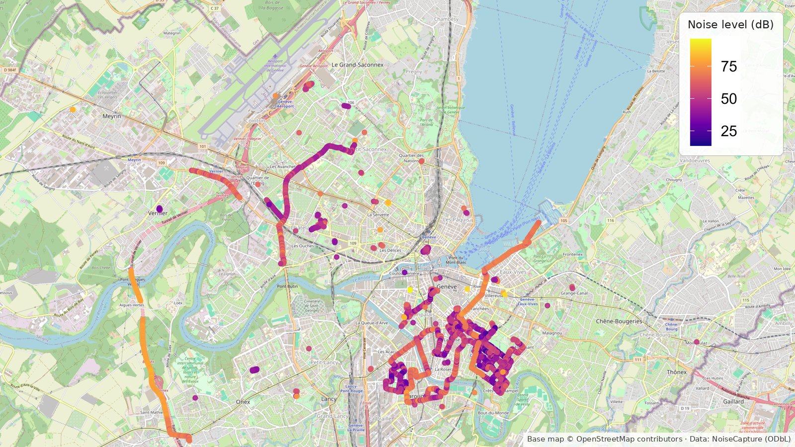
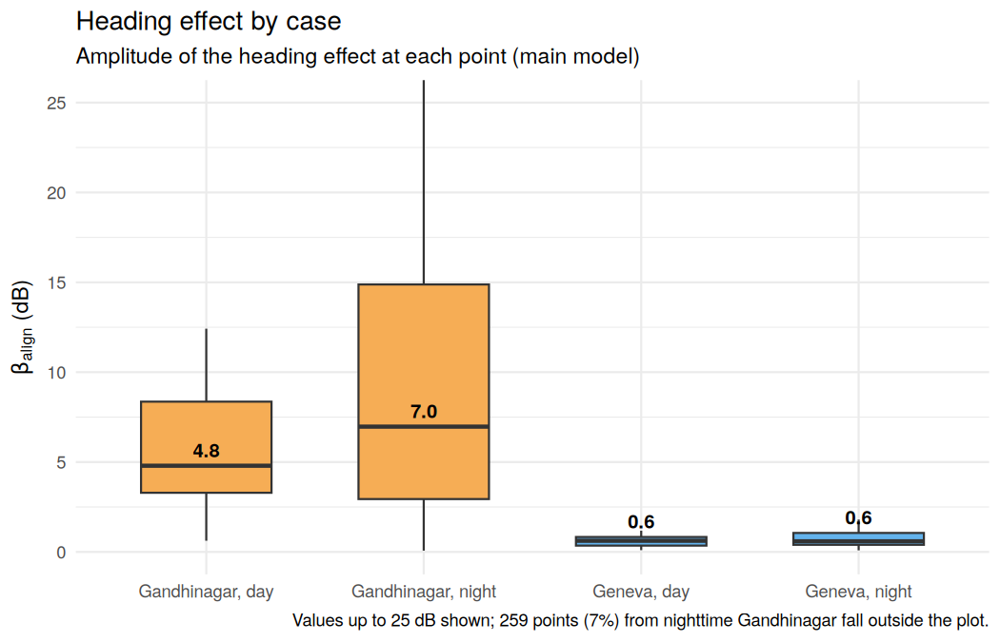
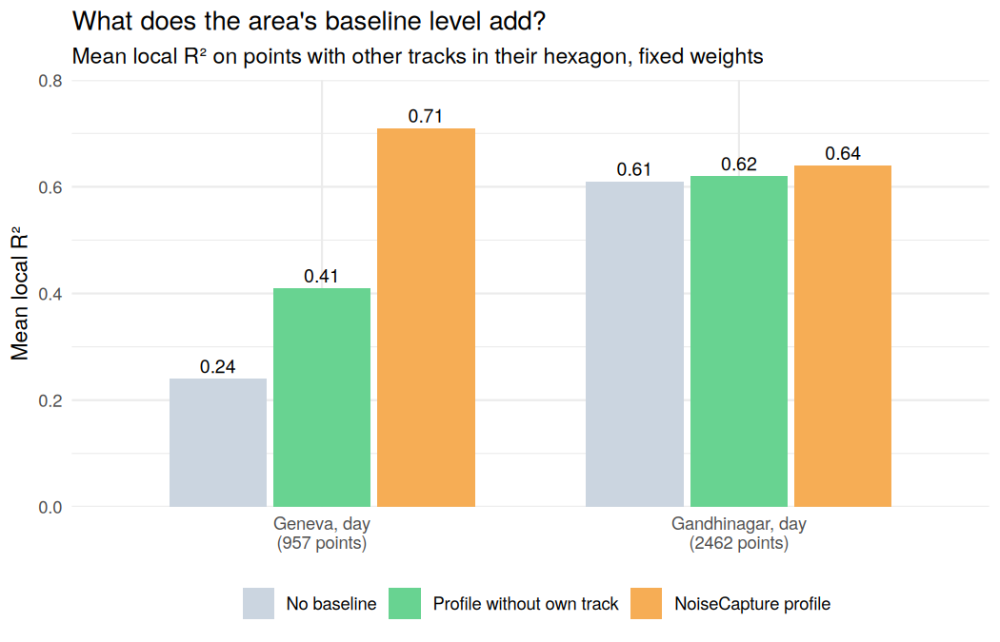
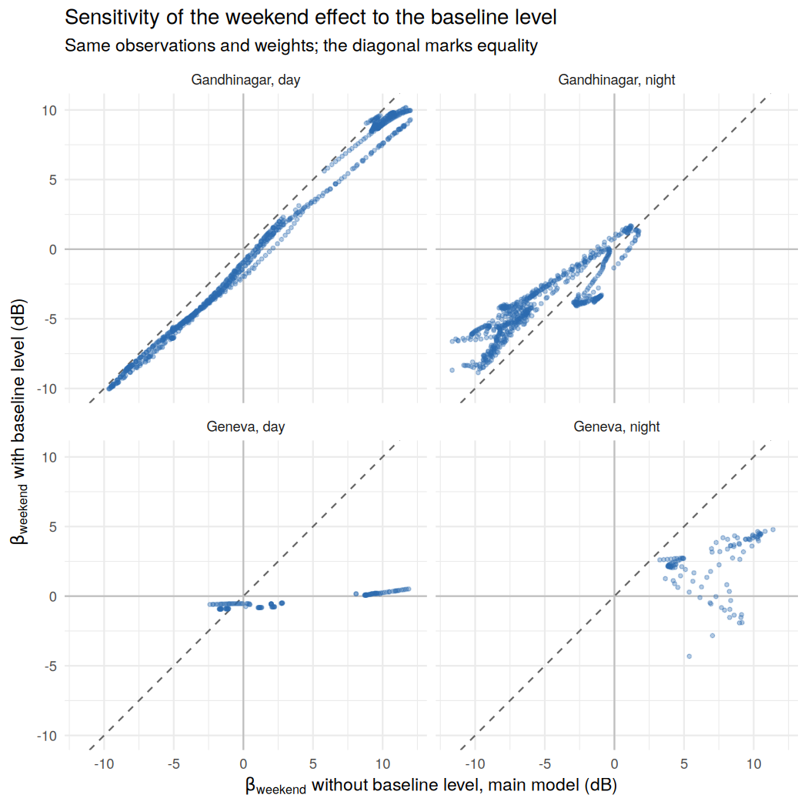
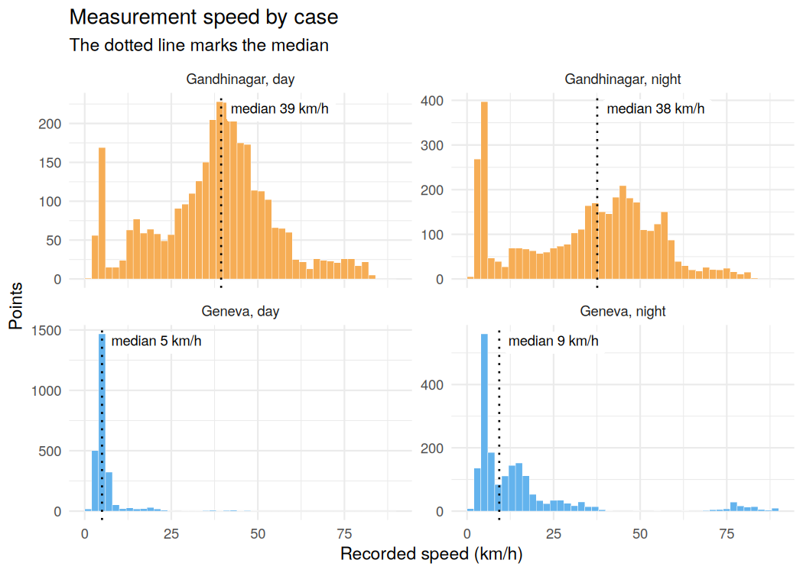

# Spatial structure of urban noise

**English** | [Español](README.es.md)

Can urban traffic dynamics be inferred from the spatial structure of
noise levels? This project analyzes crowdsourced noise measurements in
Geneva (Switzerland) and Gandhinagar (India), across day/night and
weekday/weekend.



*NoiseCapture measurements in Geneva, coloured by noise level.*

## Summary

- **On the maps, heading matters much more in Gandhinagar than in Geneva, but
  mostly because of differences between tracks.** GWR associates typical gaps
  of 10 to 14 dB with heading in Gandhinagar. A hierarchical model, which
  separates each track's own level, reduces the effect to 2 to 3 dB within a
  single track; in Geneva it cannot be distinguished.
- **Speed does have an effect within each track:** 0.45 to 1.7 dB per m/s,
  depending on the case.
- **Weekends can only be compared across different tracks.** Once that is taken
  into account, the nighttime decrease in Gandhinagar (−3.5 ± 2.5 dB) cannot be
  distinguished from zero, while Geneva's louder weekends (+9 to +13 dB) hold.
- **NoiseCapture's hourly profile proved unreliable as a control in Geneva.**
  Most points do not share their hexagon with other tracks, and the fit
  depended heavily on how that profile was built. The main model therefore
  leaves it out.
- **The cities were measured differently,** mostly from vehicles in
  Gandhinagar and mostly on foot in daytime Geneva. Comparisons are therefore
  limited to spatial and temporal structure, and the results describe
  associations, not causal effects.
- **These associations describe the sample but say little about new tracks.**
  When predicting tracks left out of the fit, the mean absolute error was 8.6
  to 12.2 dB, close to what the mean alone achieves (9.7 to 12.0 dB). Between
  62% and 77% of the variation in level lies between tracks. If the start of
  each track is known, the error falls to 4.5 to 7.4 dB, but the model then
  does no better than the level the track started with.

## Interactive maps

- [Gandhinagar — daytime](https://ca90m.github.io/urban-noise-spatial-analysis/gandhinagar_dia.html)
- [Gandhinagar — nighttime](https://ca90m.github.io/urban-noise-spatial-analysis/gandhinagar_noche.html)
- [Geneva — daytime](https://ca90m.github.io/urban-noise-spatial-analysis/ginebra_dia.html)
- [Geneva — nighttime](https://ca90m.github.io/urban-noise-spatial-analysis/ginebra_noche.html)

The maps show the main models, which do not include the area's baseline
level. The version with that predictor was used for sensitivity analysis; its
results are summarized below. The map coefficients mix differences within
each track and between tracks; the section *Effects within tracks* shows how
much of each effect remains once they are separated.

Built with leaflet in R. They open in any browser, no installation needed.
Layer controls and popups can be switched between Spanish and English.


## Data

Mobile noise measurements with sound level, speed, heading, GPS accuracy
and a device calibration gain, from the NoiseCapture crowdsourced
dataset ([Noise-Planet](https://noise-planet.org/), UMRAE and Lab-STICC,
distributed under [ODbL](https://opendatacommons.org/licenses/odbl/)).
Measurements come from an Android app, which explains the wide spread in
device calibration gain. The data is hierarchical: samples belong to
tracks, and tracks to urban areas. Records were filtered by
spatio-temporal quality criteria and accuracy thresholds, and timestamps
corrected to local time.

## Approach

**Spatial dependence.** Moran's I and LISA showed global spatial
autocorrelation and local clusters in noise levels. GWR was used to
explore how the associations with speed and movement direction varied
across the study areas.

**Local regression.** Geographically Weighted Regression (GWR) was fitted with
two representations of heading: directional (0–360°), which distinguishes
opposite directions of travel, and axial (0° ≡ 180°), which treats them as
equivalent. The comparison aimed to assess whether noise levels were mainly
associated with the axis of movement or whether distinguishing the direction
of travel added information.

Street geometry and sound reflections between façades motivated examining
patterns associated with the axis of travel. Differences in exposure to sound
sources and variation in sound emission across directions could also produce
differences between opposite directions of travel. The possible role of the
Doppler effect was also considered, linked to relative motion between source
and receiver and the change in the received frequency.

The recorded heading describes the movement of the person taking the
measurements and does not directly identify the direction from which sound
arrives. The comparison therefore helps assess which representation of heading
is more useful, although differences in model fit alone cannot identify the
physical mechanisms behind the observed patterns.

**Model specification.** For each measurement $i$ at location $u_i$, the
noise level $L_i$ (dB) is modelled as:

```math
\begin{aligned}
L_i ={}& \beta_0(u_i) + \beta_{\text{speed}}(u_i)\,v_i
       + \beta_{\cos}(u_i)\,\tilde c_i + \beta_{\sin}(u_i)\,\tilde s_i
       + v_i\big[\gamma_{\cos}(u_i)\,\tilde c_i + \gamma_{\sin}(u_i)\,\tilde s_i\big] \\
      &+ \beta_{\text{hs}}(u_i)\,h^s_i + \beta_{\text{hc}}(u_i)\,h^c_i
       + \beta_{\text{count}}(u_i)\,m_i
       + \beta_{\text{weekend}}(u_i)\,w_i + \varepsilon_i
\end{aligned}
```

All coefficients vary with location: GWR estimates them at each point,
weighting nearby observations more. $v_i$ is standardized speed. $\tilde c_i$
and $\tilde s_i$ are the cosine and sine of heading $\theta_i$, centred on
their mean: $\cos\theta_i$ and $\sin\theta_i$ in the directional model,
$\cos 2\theta_i$ and $\sin 2\theta_i$ in the axial one. The latter take the
same value at $\theta$ and $\theta + 180^\circ$, so opposite directions are not
told apart. The bracketed term lets the heading effect change with speed.

The remaining terms are controls. $h^c_i$ and $h^s_i$ encode hour as the
cosine and sine of $2\pi \cdot \text{hour}_i / 24$, so 23:00 and 00:00 stay
close. The sine enters residualized: it is replaced by its residual from a
linear regression on the cosine (i.e. it is orthogonalized). This is only a
reparametrization: the fit and the residuals do not change. $m_i$ is the log of
one plus the measurement count of the NoiseCapture area containing the point,
standardized. $w_i$ is a centred weekend indicator.

How to read each coefficient:

| Coefficient | What it measures |
|---|---|
| $\beta_0$ | Local baseline: expected level at mean speed, with the other variables at their reference values. Shown on the maps shifted to zero speed. |
| $\beta_{\text{speed}}$ | dB change per standard deviation of speed, averaged over headings. Shown on the maps in dB per m/s. |
| $\beta_{\cos}$, $\beta_{\sin}$ | Heading effect at mean speed. In the directional model, $\beta_{\cos}$ contrasts travelling north with travelling south, and $\beta_{\sin}$ east with west. In the axial model, $\beta_{\cos}$ contrasts the north–south axis with the east–west axis, and $\beta_{\sin}$ the northeast–southwest axis with the northwest–southeast one. In every case the gap between the two is twice the coefficient, and a positive value means the first is louder. On their own they depend on how the axes are oriented, so they are summarized as $\beta_{\text{align}}$. |
| $\gamma_{\cos}$, $\gamma_{\sin}$ | How much the heading effect changes per standard deviation of speed. Read the other way, whether the speed effect depends on heading. |
| $\beta_{\text{hc}}$, $\beta_{\text{hs}}$ | Jointly describe hourly variation in level within each period (day 07–19, night 19–07) through cosine and sine terms. |
| $\beta_{\text{count}}$ | dB per standard deviation of the log measurement count. Mainly a control for sampling intensity, with no direct physical reading. |
| $\beta_{\text{weekend}}$ | Local weekend-minus-weekday difference in level, in dB, adjusted for speed, heading, hour and measurement count. |
| $\beta_{\text{align}}$ | Amplitude of the heading effect, in dB. See below. |

Both variants share the same terms and differ only in heading encoding.
Bandwidth is adaptive and was selected by AICc together with the kernel
(Gaussian or bisquare). The variant with the higher mean local R² was kept,
with AICc as tie-breaker.

**Area baseline level: evaluated and excluded from the main model.**
NoiseCapture publishes, for each hexagon of 15 m radius, an hourly sound-level
profile (the median, LA50, of each hour on weekdays, Saturdays and Sundays).
That profile could serve as a control for local context, but it is computed
from the same crowdsourced measurements being modelled. To assess how much the
fit depended on measurements from the point's own track, an alternative
profile was built from the raw points: for each point, the median of its
hexagon, hour and type of day, excluding every measurement from its own track.
When no other track had measurements in that combination of hour and type of
day, the overall median of the hexagon was used, also excluding the evaluated
track. Three versions of the model were compared on the same observations and
with the same weights: no baseline, the profile without the own track, and
the NoiseCapture profile. The results (see Findings) led to excluding it from
the main model. The version with the NoiseCapture profile is kept as a
sensitivity analysis, with the same observations, heading encoding and spatial
weights as the main model.

**Alignment coefficient.** The heading effect is summarized as one value per
location:

```math
\beta_{\text{align}}(u) = \sqrt{\beta_{\cos}(u)^2 + \beta_{\sin}(u)^2}
```

At mean speed, the heading term is a wave of amplitude $\beta_{\text{align}}$,
with a period of 360° in the directional model and 180° in the axial one.
Depending on heading, the level rises or falls by up to that many dB, so the
loudest and quietest headings differ by twice that. It is never negative.

**Handling device calibration.** Tracks are not a useful grouping for the
context of a place, since samples from one track can be far apart in space and
time; they are useful for representing measurement conditions, as in the
hierarchical model described below. Calibration gain is a device property, and residual magnitude changed
with it. This was tested by modelling $\log r_i^2$ against gain: a GAM in
Gandhinagar, an ANOVA in Geneva, where gain takes few distinct values.
Measured around zero, this magnitude reflects both spread and bias. In daytime
Gandhinagar the effect was significant (p < 2e-16), with typical residual
magnitude at the 95th gain percentile about 1.36 times that at the 5th. In
daytime Geneva it was also significant (p < 2e-16), but reversed (0.71).

This was handled in two steps. First, a robust LOESS $\hat b(g)$ of residual
on gain gives a bias estimate that is subtracted and re-centred:

```math
r^{\text{db}}_i = r_i - \hat b(g_i) - \mathrm{median}\big(r - \hat b(g)\big)
```

Second, since variance still differs by gain level, anomaly thresholds were
computed per gain bin $k$ (≤ −20, −20 to −15, −15 to −12, > −12 dB) from the
local residual distribution:

```math
U_k = \max\big\{\,5\ \text{dB},\ \mathrm{P}_{95}\big(|r^{\text{db}}| \text{ within bin } k\big)\big\}
```

Bins with under 100 points use the global 95th percentile. A point is flagged
only if it exceeds its bin threshold and also belongs to a LISA high-high
cluster of $\lvert r^{\text{db}} \rvert$ (4 nearest neighbours, α = 0.05, residual and
neighbour average both above 5 dB). Isolated errors are left out; areas where
the model fails consistently are kept.

**Hierarchical model with calibration-dependent variance.** Measurements are
nested in tracks: measurement $i$ belongs to track $j$. Each track has its own
conditions that do not change along the way, such as the device, its
calibration, how the phone is carried or the day, and residual magnitude
varies with gain. To separate effects that occur within a single track from
differences between tracks, a global model was fitted with a random intercept
per track and a separate variance per gain group, on the same points and terms
as the main model:

```math
\begin{aligned}
L_{ij} &= \beta_0 + \mathbf{x}_{ij}^\top \boldsymbol\beta + \beta_{\text{weekend}}\, w_j + u_j + \varepsilon_{ij} \\
u_j &\sim N(0, \tau^2), \qquad \varepsilon_{ij} \sim N\big(0, \sigma^2_{g(j)}\big)
\end{aligned}
```

$\mathbf{x}_{ij}$ holds speed, heading, their interactions, hour and the area
measurement count. $u_j$ is track $j$'s level offset, i.e. how far above or
below expectation it measures, and $g(j)$ is its gain
group: each observed value in Geneva, where there are few, and quartiles in
Gandhinagar. The per-group variance was tested with a likelihood-ratio test
against the common-variance model.

The hierarchical model assumes $u_j$ is uncorrelated with the predictors. As a
check, a track fixed-effects model was also estimated, which makes no such
assumption: each variable has its track mean subtracted, so coefficients are
estimated only from variation within each track:

```math
L_{ij} - \bar L_j = (\mathbf{x}_{ij} - \bar{\mathbf{x}}_j)^\top \boldsymbol\beta + (\varepsilon_{ij} - \bar\varepsilon_j)
```

It is fitted by weighted least squares, with weights $1/\hat\sigma^2_{g(j)}$
and track-clustered standard errors. Terms that are constant within a track
drop out: the weekend effect cannot be estimated this way, since each track
takes place on a single day, and hour barely varies within a track, so it is
left out too. Both models are compared with the global regression without
track structure. Finally, GWR was refitted on track-centred variables with the
same spatial weights as the main model, to compare the
$\beta_{\text{align}}$ maps.

## Operational labels

Each location is assigned a regime based on which of its local
coefficients dominates. Coefficients are compared against their own
distribution within each city and period, so labels are relative: they show
which effect stands out locally, not values comparable across cities.

| Label | Interpretation |
|---|---|
| Speed-dominant | Noise tracks travel speed; direction matters little. |
| Urban canyon / directional | Orientation dominates: the same speed sounds different depending on the axis of travel. Consistent with enclosed streets. |
| Stationary base | High local baseline with weak speed and orientation effects. The level depends more on the place than on how the measurer moves. |
| Uniform noise | Speed and orientation effects tied or relatively weak, with the predicted level within 3 dB of the intercept and the intercept close to the case median. |
| Transitional / mixed | No clear dominance of speed or orientation under the rules used: their normalized magnitudes are comparable or both relatively low. |
| Anomalous / review | Residual exceeds the calibration-adjusted threshold for its gain bin and sits in a cluster of high residuals. Flagged for inspection rather than interpreted. |

### Assignment rules

Speed and alignment coefficients are normalized by their 75th percentile
within each case:

```math
s_i = \frac{|\beta_{\text{speed},i}|}{\mathrm{P}_{75}\big(|\beta_{\text{speed}}|\big)},
\qquad
a_i = \frac{\beta_{\text{align},i}}{\mathrm{P}_{75}\big(\beta_{\text{align}}\big)}
```

An effect is strong if $\max(s_i, a_i) \ge 0.8$, and the two are tied if
$s_i / a_i$ lies between $1/1.2$ and $1.2$. Labels are assigned in this order,
and each point gets the first one it meets:

1. **Anomalous / review**: meets the anomaly criterion under device
   calibration.
2. **Speed-dominant**: a strong effect and $s_i / a_i \gt 1.2$.
3. **Urban canyon / directional**: a strong effect and $s_i / a_i \lt 1/1.2$.
4. **Stationary base**: the intercept exceeds its 75th percentile, and neither
   speed nor alignment exceeds its 75th percentile.
5. **Transitional / mixed**: everything else, i.e. ties or both effects weak.

Finally, a non-anomalous point with a tie or weak effects becomes **uniform
noise** if its predicted level is within 3 dB of its intercept and the
intercept is near the median (within 0.33 IQR).

Labels are computed from GWR coefficients, which mix differences within each
track and between tracks. How far they hold once these are separated is
assessed in *Effects within tracks*.

## Findings

**The anomaly criterion cuts flagged points by an order of magnitude.**
Depending on the case, a fixed 5 dB cutoff flags 27% to 52% of points.
Requiring a spatial cluster of high residuals (LISA high-high) brings that to
4–8%, and the per-gain-bin threshold to 1.8–2.6%. The final rate per gain bin
ranges from 0% to 3%; an even rate is partly expected by construction, since
each threshold is a within-bin percentile. As an additional diagnostic, the
Spearman correlation between each track's median gain and its share of
anomalous points was computed. It was weak in three cases (−0.11 to +0.01;
p ≥ 0.38). In nighttime Gandhinagar it was +0.26 (p = 0.015): there,
higher-gain tracks tend to have more anomalies. With a Bonferroni correction for the four tests
(threshold 0.0125), that correlation is not significant. The maps keep
the separate layers so the difference can be inspected directly.

**On the maps, the directional term weighs much more in Gandhinagar than in
Geneva.** The
median alignment coefficient is 4.9 dB by day and 7.1 dB at night in
Gandhinagar, against 1.6 and 2.6 dB in Geneva. At each case's mean speed, that
means typical gaps of 10 to 14 dB between loudest and quietest heading in
Gandhinagar, and 3 to 5 dB in Geneva. A local collinearity diagnostic, using
the same weights as the fit, flags the heading effect as poorly determined at
few locations: 0% to 10% depending on the case. It uses Belsley's criterion: a
condition index above 30 with two or more terms, at least one of them a
heading term, having a variance proportion above 0.5. Excluding those
locations barely changes the medians. The axial model won selection only in
Gandhinagar at night, where it also left the cleanest residuals of the four
cases (Moran's I on residuals 0.20, against 0.30 to 0.54 elsewhere). Both
specifications use the same number of predictors and interaction terms,
differing in how movement direction is represented. That amplitude mixes
differences within each track and between tracks; within a single track it is
considerably smaller (see *Effects within tracks*).



**Weekend effects differed between cities and were larger at night.**

| | locations | median $\beta_{\text{weekend}}$ | dominant pattern |
|---|---|---|---|
| Gandhinagar, day | 906 | −0.2 dB | mixed: 38% quieter, 38% louder |
| Gandhinagar, night | 650 | −6.4 dB | 67% quieter, none louder |
| Geneva, day | 122 | +2.0 dB | 53% louder, 7% quieter |
| Geneva, night | 108 | +7.0 dB | no location with $\lvert z \rvert \ge 2$ |

Percentages of quieter and louder locations refer to estimates reaching
$\lvert z \rvert \ge 2$ among the reported locations, not just to the sign of
the coefficient.

**How $\beta_{\text{weekend}}$ is estimated and filtered.** It is the
coefficient on the weekend indicator: the local weekend-minus-weekday
difference, in dB, adjusted for the other model terms. It is reported only
where it can be estimated reasonably: among the $k$ nearest neighbours (10% of
points, bounded to 30–150), 10–90% of measurements are from weekends, local R²
is at least 0.5, and the effect is within ±12 dB. An effect counts as
distinguishable when the coefficient is at least twice its standard error in
absolute value.

In daytime Gandhinagar the median is close to zero, yet 76% of locations show
a distinguishable effect, split evenly between quieter and louder weekends
along different corridors. At night, by contrast, the decrease clearly
dominates. In nighttime Geneva the median is high, but no location reaches
$\lvert z \rvert \ge 2$: the estimated effect is large and imprecise.

These percentages should be read with caution. Each track takes place on a
single day, so the weekend effect can only be estimated by comparing different
tracks, and GWR's local standard errors treat every point as independent. In
the global regression, the track-clustered standard error is 1.6 to 8 times the
one that assumes independence, so the percentages in the table are overstated.
The hierarchical model gives one estimate per case (see *Effects within
tracks*).

**Model fit was sensitive to how the baseline level was built.** When the own
track is excluded, many points are left with no other measurement in their
hexagon:

| Situation when the own track is excluded | Geneva, day | Geneva, night | Gandhinagar, day |
|---|---|---|---|
| Other tracks in the hexagon, at the same hour and type of day | 3% | 5% | 28% |
| Other tracks in the hexagon, outside that combination of hour and type of day | 36% | 35% | 47% |
| No other track in the hexagon | 61% | 60% | 25% |

In Gandhinagar, percentages refer to points falling inside some hexagon. In the
raw points available for Geneva, most observations do not share their hexagon
with other tracks. On the points that do (957 in daytime Geneva and 2462 in
daytime Gandhinagar), the three model versions gave:



In daytime Geneva, on the common sample, mean local R² was 0.24 with no
baseline, 0.41 with the reference excluding the own track and 0.71 with the
NoiseCapture profile; residual Moran's I was 0.67, 0.55 and 0.20. The
difference is consistent with a substantial dependence on the measurements of
the point's own track, but it also reflects changes in the availability and
temporal resolution of the predictor: for most of these points, the
alternative reference is the overall median of the hexagon, not that of the
hour. The comparison cannot quantify these components separately. In daytime
Gandhinagar, the three versions fit almost equally well (0.61 to 0.64, with
Moran's I of 0.32 to 0.33): there the baseline adds little. The comparison was
run only for these two cases; it was not evaluated for nighttime Gandhinagar.

**The sensitivity analysis with the baseline confirms that contrast.** The
table compares the main model with the version including the baseline, on the
same observations and with the same spatial weights.

| | mean local R² (without / with) | residual Moran's I (without / with) | common locations | median $\beta_{\text{weekend}}$ (without / with) | same sign |
|---|---|---|---|---|---|
| Gandhinagar, day | 0.68 / 0.72 | 0.30 / 0.28 | 906 | −0.2 / −1.5 dB | 96% |
| Gandhinagar, night | 0.76 / 0.81 | 0.20 / 0.13 | 650 | −6.4 / −4.1 dB | 98% |
| Geneva, day | 0.54 / 0.83 | 0.54 / 0.06 | 122 | +2.0 / −0.5 dB | 73% |
| Geneva, night | 0.60 / 0.85 | 0.30 / −0.01 | 108 | +7.0 / +2.5 dB | 85% |

Mean local R² and Moran's I refer to each case's fitting sample. Weekend
medians and sign-agreement percentages are computed only on locations meeting
the reporting filters in both versions, including the ±12 dB limit. They do not
represent all estimates or the whole city.

In Gandhinagar, adding the baseline improves fit only slightly and the weekend
effect keeps its sign at almost every location; the nighttime decrease holds
in both versions. In Geneva, the baseline raises R² sharply and nearly removes
residual autocorrelation, consistent with it reusing the measurement itself.
With it, none of the compared Geneva locations shows a distinguishable weekend
effect; without it, 53% of daytime Geneva locations are louder at weekends.



**Model fit varied across the assigned labels.** Stationary-base locations had
the highest mean local R² in all four cases (0.73 to 0.84) and the lowest mean
|residual| in three (2.4 to 5.4 dB). In daytime Gandhinagar, the lowest
residual belonged to urban canyon (2.4 dB). Uniform noise fit worst among the
regular regimes in all four cases (mean local R² 0.41 to 0.62). The anomalous
class isolates mean absolute residuals of 16 to 21 dB in at most 2.6% of
points. Mean local R² ranges from 0.54 to 0.76.

**Out of sample, the model says little about the level of new tracks.** To
assess how far these associations generalize, whole tracks were held out. Each
case's tracks were split into five groups, and each group was predicted with a
model fitted only on the others. Within each split, everything learned from
the data was recomputed on the training tracks: centring, standardization, the
residualized hour term, and the choice of heading encoding, kernel and
bandwidth. The area measurement count was recomputed without the test tracks'
measurements, as if they were not yet in the database. GWR was compared with a
global regression with the same terms and with the training mean.

| | Mean absolute error: GWR | Global regression | Training mean | Tracks where GWR beats the global model |
|---|---|---|---|---|
| Gandhinagar, day | 8.6 dB | 10.5 dB | 9.7 dB | 57% of 74 |
| Gandhinagar, night | 11.6 dB | 11.0 dB | 12.0 dB | 39% of 90 |
| Geneva, day | 10.9 dB | 12.5 dB | 11.0 dB | 61% of 66 |
| Geneva, night | 12.2 dB | 9.8 dB | 11.9 dB | 56% of 45 |

Errors are computed over all test observations. The last column compares each
track's mean error (paired Wilcoxon test: p = 0.27, 0.025, 0.038 and 0.48, in
table order). No model improves on the training mean by more than about 2 dB,
with typical errors of 9 to 12 dB.

The main reason is that most of the variation lies between tracks: 62% to 77%
of the variance in level comes from differences in mean level between tracks,
which may reflect the device, its calibration or the context of each
measurement. GWR partly anticipates a track's overall level from where it was
measured (correlation of 0.25 to 0.48 between each track's predicted and
observed mean level), and does so better than the global regression by day.
But neither model anticipates how the level varies along a new track: within
tracks, the correlation between measured and predicted level ranges from −0.05
to +0.07 for GWR and from +0.02 to +0.21 for the global regression. At night,
GWR's local coefficients also produce some extreme predictions: 3% of errors in
Gandhinagar and 8% in Geneva exceed 30 dB.

The mean local R² of 0.54 to 0.76 therefore mostly reflects level differences
between tracks, which the model reproduces largely because each track is part
of its own neighbourhood. The same applies to residual autocorrelation:
Moran's I is computed with the 4 nearest neighbours, and 70% to 93% of them
belong to the same track depending on the case. Its value (0.20 to 0.54)
therefore largely reflects how persistent each track's level offset is. The
coefficients and maps describe the measured sample; they are not
relationships that carry over directly to new measurements.

**Knowing the start of a track cuts the error sharply, but the model adds
nothing to that.** Since most of the error is each track's level offset, it
was estimated from the start of each test track (cross-calibration). Using
the first points $C_j$ of track $j$, in time order, the offset is estimated by
comparing what was measured with what the model predicts from the other
tracks, and added to the prediction for the rest:

```math
\hat u_j = \frac{1}{n_c}\sum_{i \in C_j}\big(y_{ij} - \hat y_{ij}\big), \qquad \hat y^{\,\text{cal}}_{ij} = \hat y_{ij} + \hat u_j \quad (i \notin C_j)
```

In the hierarchical model, fitted within each split, the offset is also shrunk
according to how much information the calibration points carry, by the
factor $\hat\tau^2/(\hat\tau^2 + \hat\sigma^2/n_c)$. Mean absolute error on the
rest of each track, without and with calibration, using the first 20%:

| | GWR | Global regression | Hierarchical model | Training mean |
|---|---|---|---|---|
| Gandhinagar, day | 8.9 → 8.3 | 10.8 → 5.8 | 11.2 → 4.5 | 10.0 → 4.6 |
| Gandhinagar, night | 11.2 → 11.8 | 10.9 → 7.1 | 10.1 → 5.6 | 12.3 → 5.9 |
| Geneva, day | 11.1 → 7.9 | 12.6 → 7.3 | 11.3 → 7.4 | 11.2 → 7.3 |
| Geneva, night | 11.4 → 11.1 | 9.7 → 7.6 | 9.7 → 7.3 | 11.9 → 7.1 |

Calibration reduces the error of the global regression, the hierarchical model
and the mean from 10 to 12 dB to between 4.5 and 7.6 dB, with almost the same
results using the first 10% or 30%. But once calibrated, the hierarchical
model does no better than the calibrated training mean, which is simply the
mean level of the start of the track
($\bar y_{\text{train}} + \hat u_j = \bar y_{C_j}$): the per-track difference is
not significant in any case (paired Wilcoxon test with the first 20%,
p ≥ 0.11). Calibrated GWR does worst. In other words, speed, heading and hour
have real effects, but small ones next to second-to-second variation. Part of
the improvement may come from later minutes resembling the first ones (same
area, same traffic), not only from device calibration.

### Effects within tracks

The tables compare three global estimates on the same points and terms as the
main model: the global regression without track structure, the hierarchical
model with gain-dependent variance, and the track fixed-effects model, weighted
by that same variance. Standard errors are in parentheses: track-clustered for
the global regression and fixed effects, model-based for the hierarchical
model. The hierarchical model's errors assume that, given each track's level,
its points are independent. Since consecutive points resemble each other,
they are optimistic for effects that vary within tracks; for those,
significance is judged with the fixed-effects model's clustered errors. For
the weekend, which can only be compared across tracks, the hierarchical model
is the appropriate one.

**Most of the heading effect on the maps is a difference between tracks.**
Amplitude of the heading effect at mean speed, in dB:

| | Global regression | Hierarchical model | Track fixed effects | Median $\beta_{\text{align}}$: maps → within-track GWR |
|---|---|---|---|---|
| Gandhinagar, day | 3.2 (1.5) | 1.0 (0.2) | 1.1 (0.5) | 4.9 → 2.1 |
| Gandhinagar, night | 7.2 (1.8) | 1.5 (0.2) | 1.5 (0.6) | 7.1 → 2.8 |
| Geneva, day | 1.5 (1.8) | 0.5 (0.3) | 0.4 (0.7) | 1.6 → 1.6 |
| Geneva, night | 1.8 (1.0) | 1.8 (0.3) | 1.8 (1.1) | 2.6 → 2.8 |

In Gandhinagar, the hierarchical and fixed-effects models agree: within a
single track, the level differs by 2 to 3 dB between the loudest and quietest
heading, against 10 to 14 dB on the maps. That effect is distinguishable from
zero (Wald test of the heading terms with clustered errors, unweighted:
p = 0.0005 by day and 0.009 at night). The last column refits GWR on
track-centred variables with the same spatial weights: local amplitudes fall
to less than half, and their spatial pattern barely resembles the maps'
(Spearman correlation of −0.10 by day and 0.22 at night). Since the amplitude
is never negative, estimation noise inflates it, so those medians are an
upper bound. In Geneva, with clustered errors, the main heading effect cannot
be distinguished from zero within tracks; by day it appears only in
interaction with speed.

**Speed does have an effect within tracks.** In dB per m/s:

| | Global regression | Hierarchical model | Track fixed effects |
|---|---|---|---|
| Gandhinagar, day | 0.91 (0.15) | 0.50 (0.03) | 0.48 (0.07) |
| Gandhinagar, night | 0.73 (0.34) | 0.45 (0.04) | 0.45 (0.08) |
| Geneva, day | 1.10 (0.76) | 1.66 (0.28) | 1.60 (0.48) |
| Geneva, night | 1.06 (0.24) | 0.64 (0.09) | 0.64 (0.07) |

Within a single track, moving faster is associated with more noise in all
four cases. In Gandhinagar, roughly 40% to 50% of the global regression's
association came from differences between tracks, for example between walking and vehicle
measurements, or between devices.

**The weekend effect, estimated across tracks, is more uncertain.**
Weekend-minus-weekday difference, in dB:

| | GWR: local median | Global regression: common / clustered standard error | Hierarchical model |
|---|---|---|---|
| Gandhinagar, day | −0.2 | +4.1 (0.5 / 3.2) | −0.9 (4.5) |
| Gandhinagar, night | −6.4 | −11.8 (0.8 / 2.8) | −3.5 (2.5) |
| Geneva, day | +2.0 | +2.9 (0.9 / 7.3) | +9.2 (3.6) |
| Geneva, night | +7.0 | +11.5 (1.0 / 1.5) | +13.1 (4.8) |

Since each track takes place on a single day, this effect cannot be estimated
within tracks. The hierarchical model estimates it by comparing tracks, with
the uncertainty that comparison carries. In nighttime Gandhinagar it keeps
the negative sign but cannot be distinguished from zero; in Geneva, the
louder weekends are distinguishable. Even so, different tracks are being
compared, and the difference may reflect different devices or people as well
as the day.

**Variance depends on calibration.** The likelihood-ratio test rejects a
common variance in all four cases (p < 1e−69). The residual standard
deviation across gain groups ranges from 2.8 to 8.2 dB in daytime Gandhinagar,
3.6 to 8.0 dB at night, 4.9 to 10.2 dB in daytime Geneva and 2.0 to 9.2 dB at
night. Without weighting, estimates shift somewhat (for example, the
within-track heading amplitude in daytime Gandhinagar goes from 1.1 to
1.9 dB), but the conclusions do not change.

**The speed and heading labels hold only in part.** The speed-versus-heading
classification behind the labels was recomputed, with the same 75th-percentile
normalization rules, from the coefficients of GWR fitted on track-centred
data, and compared with the original using Cohen's kappa:

```math
\kappa = \frac{p_o - p_e}{1 - p_e}
```

where $p_o$ is the share of locations with the same class in both versions and
$p_e$ the share expected by chance. The stationary base cannot be assessed this
way, since centring by track removes the level of the place.

| | Agreement | $\kappa$ | Keep the speed class | Keep the heading class |
|---|---|---|---|---|
| Gandhinagar, day | 53% | 0.24 | 58% | 39% |
| Gandhinagar, night | 52% | 0.26 | 60% | 38% |
| Geneva, day | 36% | −0.04 | 57% | 4% |
| Geneva, night | 60% | 0.37 | 55% | 55% |

Since local coefficients carry a lot of estimation error, $\kappa$ falls short
of 1 even when the effect exists: on simulated data, the same procedure gives
about 0.3 when heading acts within tracks and about 0 when it is associated
only through them. The speed classification is kept at more than half of the
locations in all four cases. The heading classification is kept at under 40%
in Gandhinagar and practically vanishes in daytime Geneva (4%): there, the
urban-canyon label mostly reflects differences between tracks.

## Interpretation

In Gandhinagar, where most measurements were taken at vehicle speeds, GWR
strongly ties noise to heading: about 10 to 14 dB at mean speed. But most of
that association comes from differences between tracks: within a single track
the effect is 2 to 3 dB, and the spatial pattern of the maps is not
reproduced. The corridors shown on the maps mostly reflect which tracks, with
which device and measurement mode, went along each street and in which
direction. The effect that remains within tracks is consistent with the
vehicle's own noise, with different exposure to traffic depending on the
direction, or with street geometry. The nighttime weekend decrease appears at
most GWR locations, but estimated across tracks (−3.5 ± 2.5 dB) it cannot be
distinguished from zero.

In Geneva, speeds were predominantly consistent with walking by day, while
the nighttime period showed a broader mix. There, no heading effect can be
distinguished within tracks, and the model explains a smaller share of the
variation. Louder weekends hold in the hierarchical model (+9 to +13 dB), but
they compare different tracks, so differences in device or in who measured
cannot be ruled out.

Since the two cities were measured differently, the share of the differences
between them due to the cities rather than the measurement mode cannot be
separated. The results describe associations, not causal effects.

## Conclusions

- **In this crowdsourced data, measurement conditions matter more than place.**
  Between 62% and 77% of the variation in level comes from differences in mean
  level between tracks. Device calibration is the part that can be measured:
  the gain group explains 28% to 52% of those differences (weighting each track
  by its number of points), and it also changes measurement noise, with
  residual standard deviations of 2 to 10 dB depending on the group. The rest
  comes from track-specific conditions not recorded in the data, such as how
  the phone was carried, the travel mode or the day.
- **A spatial model that ignores tracks confuses place with who measured.**
  The patterns on the GWR maps largely reflect which tracks went through each
  area. Local R² and residual autocorrelation are inflated because each track
  forms its own neighbourhood, and local standard errors overstate
  significance. GWR therefore describes the sample but says little about the
  level of new tracks: its out-of-sample error (8.6 to 12.2 dB) is close to
  that of the mean. Even knowing each track's offset, no model predicts the
  rest of the track better than its starting level.
- **Where a place was measured by a single track, the street cannot be
  separated from the device.** In Geneva, about 60% of points do not share
  their hexagon with any other track; there, a level difference may come from
  the place or from the phone.
- **What holds once tracks are separated is narrower.** Speed is associated
  with more noise within a single track in all four cases (0.45 to 1.7 dB per
  m/s). Heading has a real but small effect in Gandhinagar (2 to 3 dB between
  the loudest and quietest heading) and cannot be distinguished in Geneva.
  Weekends can only be compared across tracks: Geneva's louder weekends hold,
  and Gandhinagar's nighttime decrease cannot be distinguished from zero. In
  the labels, the speed classification largely holds once tracks are
  separated; the heading classification holds little in Gandhinagar and
  hardly at all in daytime Geneva.

## Limitations

- Recorded speeds differ sharply between cities, indicating that
  measurements were mostly taken in different ways. In Gandhinagar, 76% to
  88% of points exceed 15 km/h (median ≈39 km/h by day), consistent with
  vehicle-borne measurement. In daytime Geneva, 91% are at 8 km/h or less
  (median ≈5 km/h), consistent with walking; at night the mix is broader (47%
  at 8 km/h or less, 30% above 15 km/h). Baseline levels are not directly
  comparable (median intercept 74.4 vs 51.8 dB by day), only spatial and
  temporal structure is.

  

- Calibration also differs structurally. In Geneva, gain takes only a few
  values (four by day, five at night), with most tracks at −22.5 or 0 dB. In
  Gandhinagar it is widely dispersed: −35 to +25 dB by day and up to +64 dB at
  night. Residual variance also depends on gain; the hierarchical model
  accounts for it, but GWR assumes a common variance.

- In Gandhinagar, 31% of daytime points (1436 of 4700) and 20% of nighttime
  points (970 of 4767) are left out of the model because they fall outside
  every NoiseCapture hexagon, so they have no area measurement count. They are
  far from any area (by day, a median of 2.9 km from the nearest hexagon), so
  they were excluded rather than imputed. No Geneva points are excluded for
  this reason.

- The weekend subset is not representative in speed. Locations with
  enough weekday/weekend mix to estimate $\beta$ have a median speed of
  21.4 km/h at night in Gandhinagar, against 38 km/h for the full set.

- In Gandhinagar, tracks with one or two observations retained after
  filtering have much larger residuals (median |residual| 9.1 to
  14.6 dB, against about 3 dB elsewhere), although they hold under 1% of
  points. In Geneva the difference is smaller. The quality and influence
  of tracks with few retained observations remain to be assessed.

- The area measurement count is still a NoiseCapture aggregate that includes
  the measurements themselves; it acts as a control for sampling intensity,
  not for sound level. Part of its association with level comes from the
  track itself: at night, their correlation was −0.31 in Gandhinagar and
  −0.36 in Geneva, falling to −0.13 and −0.19 once the measurements of each
  validation split's test tracks were removed. The baseline-level evaluation
  was run only for daytime Geneva and daytime Gandhinagar, on points with
  other tracks in their hexagon. Results are read as exploratory associations,
  not as causal effects.

- In nighttime Gandhinagar, 3% of locations (109) have a heading-effect
  amplitude above 20 dB (maximum 34 dB). Almost all of them (97%) have a local
  VIF above 10 in some heading term, against 28% elsewhere: there, nearby speeds
  are concentrated far from the mean speed at which $\beta_{\text{align}}$ is
  evaluated, and the heading terms become nearly collinear with their speed
  interactions. Their approximate standard error is about three times larger
  (median 4.6 vs 1.6 dB). Those amplitudes are therefore not read as physical
  noise differences. The figure limits the visible range to 25 dB, but
  summaries are computed with all estimates.

- GWR local estimates are spatially correlated, and their standard errors
  treat every point as independent, ignoring that points from the same track
  resemble each other. So $\lvert z \rvert \ge 2$ flags locations worth
  attention rather than significance tests.

## Contents

- `README.md`: project overview in English
- `README.es.md`: project overview in Spanish
- `*.html`: standalone interactive maps
- `figures/`: README figures

## Authors

Analysis and maps in this repository: Cristian Antonio.
Part of a two-person final project for the Spatial Statistics course at
Universidad de Buenos Aires (2025), together with Ezequiel Grenat.

## Data licence

Noise data from the NoiseCapture project (Noise-Planet, UMRAE and
Lab-STICC), used under the Open Database License (ODbL).
